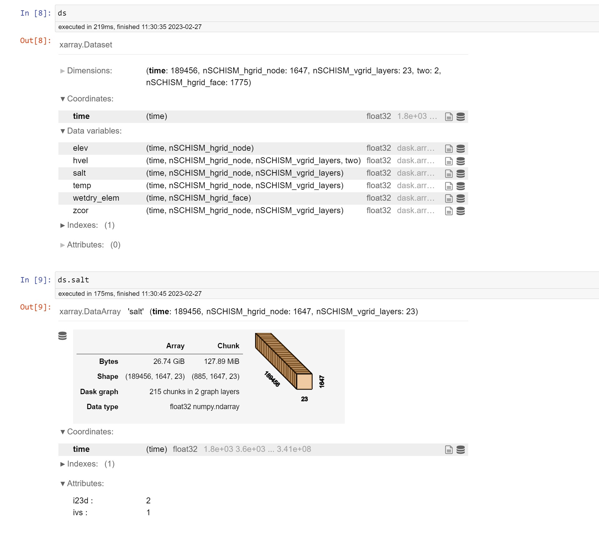
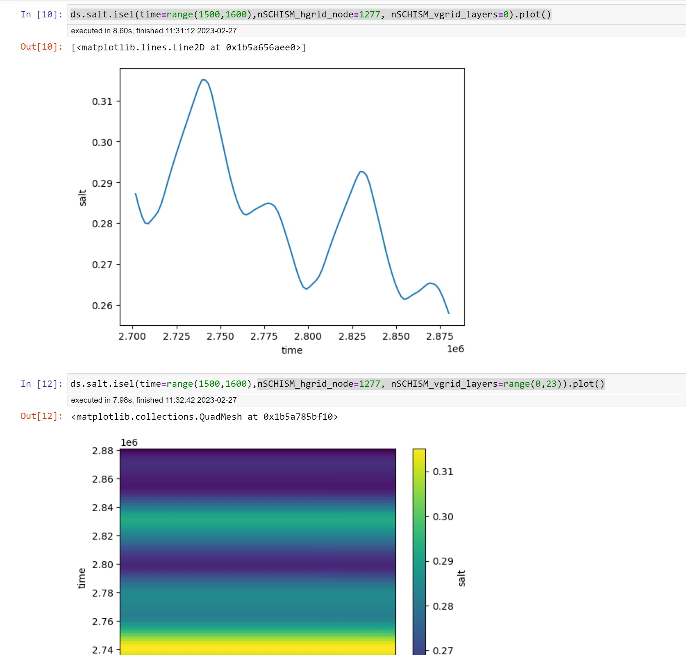

# Using kerchunk with Azure Blobs for SCHISM output

These are experimental notebooks to leverage kerchunk to generate Zarr indexes for existing netcdf files in Azure blobs

It takes a while to generate the needed jsons and combine them. These were done with dask for a subset of files and took about 30 minutes for ~ 3500 files and generated
a combined json of around 130 MB (could be compressed)

This way of access shows promise. See the screenshots for timings below :-

